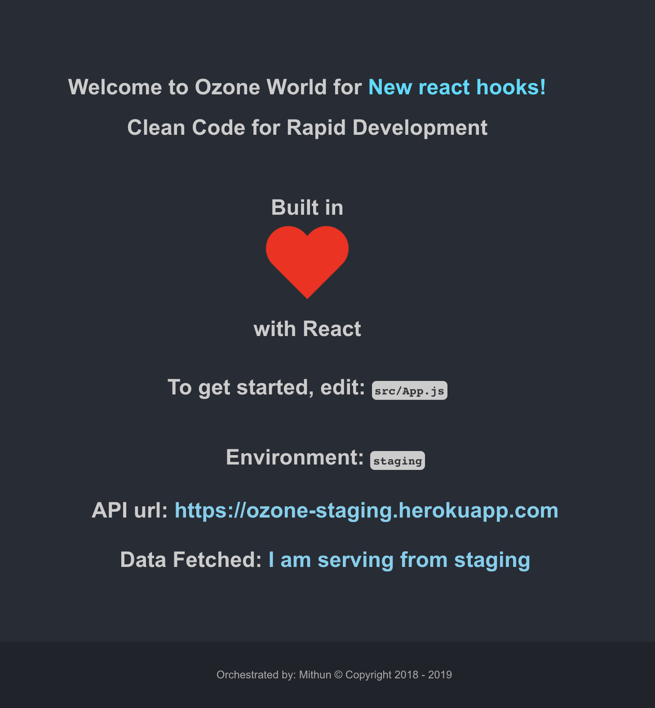

This project was bootstrapped with [Create React App](https://github.com/facebook/create-react-app).

## Preview

## Important Scripts

In the project directory, you can run:

### `npm start:dev`

Runs the app in the development mode.

API_URL: [http://localhost:4001](http://localhost:4001)
Open [http://localhost:3000](http://localhost:3000) to view it in the browser.

The page will reload if you make edits.

You will also see any lint errors in the console.

### `npm start:staging`

Runs the app in the development mode.

API_URL: [https://ozone-staging.herokuapp.com](https://ozone-staging.herokuapp.com)
Open [http://localhost:3000](http://localhost:3002) to view it in the browser.

The page will reload if you make edits.

You will also see any lint errors in the console.

### `npm start:prod`

Runs the app in the development mode.

API_URL: [https://ozone-production.herokuapp.com](https://ozone-production.herokuapp.com)
Open [http://localhost:3000](http://localhost:3003) to view it in the browser.
